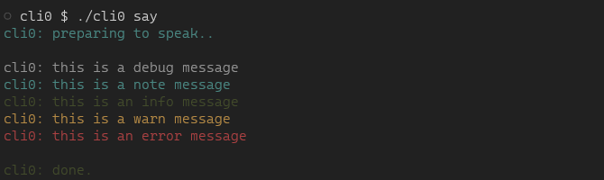
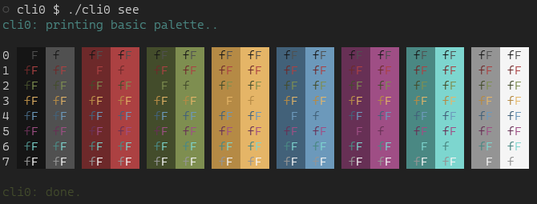

# `cli0`
_(cleo)_ cli zero —a simple shell script skeleton with no dependencies

Good for whipping up a quick command line interface with some familiar comforts:
- argument parsing
- usage info
- colored output (when appropriate) that goes to [the right place](https://web.archive.org/web/20201204114029/http://www.jstorimer.com/blogs/workingwithcode/7766119-when-to-use-stderr-instead-of-stdout)

## usage

`cli0` doesn't really do anything out of the box; it provides a template to be modified for your own purposes:

```console
$ ./cli0
provides the skeleton of a simple cli

usage:
  cli0 [<service> | --<option>]

options:
  -h --help   show this usage info
  <service>   say, see, flip
```

`cli0` provides sample service implementations to exercise the template and output formatting options:






